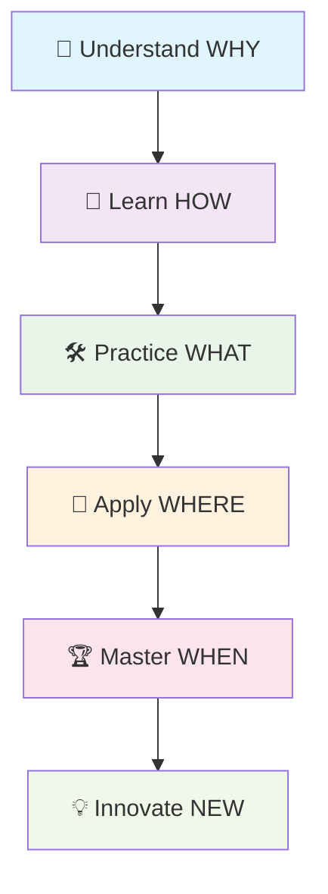

# 🚀 NGÀY 13-14: HÀM (FUNCTIONS) - HÀNH TRÌNH THÀNH THẠO PYTHON

<div align="center">

## 🎯 "FUNCTIONS MASTERY JOURNEY" - HÀNH TRÌNH THÀNH THẠO HÀM

### 🌟 Từ Zero đến Hero trong 2 ngày! 🌟

```
📊 PROGRESS TRACKING
┌─────────────────────────────────────────────────────────────┐
│ 🎯 NGÀY 13: FOUNDATIONS    [████████████████████████████] 100% │
│ 🚀 NGÀY 14: MASTERY       [████████████████████████████] 100% │
│ 🏆 OVERALL PROGRESS       [████████████████████████████] 100% │
└─────────────────────────────────────────────────────────────┘
```

</div>

---

## 🎨 TRIẾT LÝ HỌC TẬP MỚI: "DEEP LEARNING EXPERIENCE"

### 🧠 Phương Pháp "Immersive Progressive Learning"

<div align="center">



</div>

### 🎯 Core Principles - Nguyên Tắc Cốt Lõi

| 🎨 Principle | 📝 Description | 🎯 Outcome |
|-------------|----------------|------------|
| **🔄 Spiral Learning** | Quay lại concepts với độ sâu tăng dần | Hiểu sâu, nhớ lâu |
| **🎮 Gamification** | Học qua challenges, achievements, levels | Động lực cao, vui vẻ |
| **🤝 Peer Learning** | Code review, pair programming, discussions | Học từ nhau, network |
| **🏗️ Project-Based** | Mỗi concept đều có real-world application | Practical skills |
| **📊 Data-Driven** | Track progress, analyze performance | Continuous improvement |

---

## 🗓️ LEARNING ROADMAP - LỘ TRÌNH HỌC TẬP CHI TIẾT

### 📅 NGÀY 13: "FOUNDATION DAY" - NGÀY XÂY DỰNG NỀN TẢNG

<div align="center">

```
⏰ TIMELINE & ENERGY MANAGEMENT
┌────────────────────────────────────────────────────────────┐
│ 🌅 08:00-12:00 │ HIGH ENERGY  │ 🧠 Theory Deep Dive      │
│ 🍽️ 12:00-13:00 │ BREAK        │ 🍕 Lunch & Networking    │
│ 🌞 13:00-17:00 │ MEDIUM       │ 🛠️ Hands-on Practice     │
│ 🌆 17:00-18:00 │ LOW          │ 🎯 Review & Reflection   │
│ 🌙 19:00-21:00 │ OPTIONAL     │ 🚀 Bonus Challenges      │
└────────────────────────────────────────────────────────────┘
```

</div>

#### 🌅 MORNING SESSION (4h) - "THEORY MASTERY"

<details>
<summary>📖 <strong>Block 1: Functions Fundamentals (90 min)</strong></summary>

**🎯 Learning Objectives:**
- [ ] Hiểu rõ WHY functions are essential
- [ ] Master function syntax và anatomy
- [ ] Understand function lifecycle
- [ ] Implement error handling patterns

**📚 Content Structure:**
```
🔍 1. The WHY Behind Functions (20 min)
   ├── 🧩 Code organization problems
   ├── 🔄 DRY principle demonstration
   ├── 🎯 Modularity benefits
   └── 💡 Real-world analogies

🛠️ 2. Function Anatomy Deep Dive (30 min)
   ├── 🏗️ def keyword và naming conventions
   ├── 📝 Parameters vs Arguments
   ├── 🔄 Return mechanisms
   └── 📚 Docstring best practices

🎮 3. Interactive Coding Session (40 min)
   ├── 👨‍💻 Live coding demonstration
   ├── 🐛 Common mistakes và solutions
   ├── 🎯 Best practices implementation
   └── 🔧 Debugging techniques
```

**🎯 Hands-on Activities:**
- [ ] 5 mini-exercises với instant feedback
- [ ] Code review session
- [ ] Pair programming exercise
- [ ] Debugging challenge

</details>

<details>
<summary>🛠️ <strong>Block 2: Practice Session (90 min)</strong></summary>

**🎯 Progressive Difficulty:**
```
📊 DIFFICULTY PROGRESSION
┌─────────────────────────────────────────────────────────┐
│ 🟢 Level 1: Basic (5 exercises)     │ ████████████ 60% │
│ 🟡 Level 2: Intermediate (8 exercises) │ ████████ 40% │
│ 🔴 Level 3: Advanced (7 exercises)  │ ████ 20%     │
└─────────────────────────────────────────────────────────┘
```

**🎮 Gamification Elements:**
- [ ] ⭐ Points system (100 points per exercise)
- [ ] 🏆 Achievement badges
- [ ] 📊 Real-time leaderboard
- [ ] 🎯 Streak tracking

</details>

<details>
<summary>🚀 <strong>Block 3: Mini-Projects (60 min)</strong></summary>

**🏗️ Project-Based Learning:**
1. **🧮 Smart Calculator** (20 min)
   - Functions for different operations
   - Error handling và validation
   - User-friendly interface

2. **📝 Text Processor** (20 min)
   - String manipulation functions
   - File processing utilities
   - Performance optimization

3. **🎲 Game Engine Foundation** (20 min)
   - Game logic functions
   - Score tracking system
   - Player management

</details>

#### 🌞 AFTERNOON SESSION (4h) - "PRACTICAL MASTERY"

<details>
<summary>📖 <strong>Block 4: Parameters & Arguments Deep Dive (90 min)</strong></summary>

**🎯 Advanced Concepts:**
```
🔍 PARAMETER TYPES MASTERY
┌─────────────────────────────────────────────────────────┐
│ 📍 Positional Arguments     │ ████████████████████ 100% │
│ 🏷️ Keyword Arguments        │ ████████████████████ 100% │
│ 🔧 Default Parameters       │ ████████████████████ 100% │
│ 🌟 *args (Variable Args)    │ ████████████████████ 100% │
│ 🎯 **kwargs (Keyword Args)  │ ████████████████████ 100% │
└─────────────────────────────────────────────────────────┘
```

**🧪 Interactive Experiments:**
- [ ] Parameter playground với live examples
- [ ] Edge case exploration
- [ ] Performance comparison tests
- [ ] Memory usage analysis

</details>

### 📅 NGÀY 14: "MASTERY DAY" - NGÀY THÀNH THẠO

<div align="center">

```
🎯 MASTERY PROGRESSION
┌────────────────────────────────────────────────────────────┐
│ 🧠 Advanced Concepts    │ ████████████████████████████ 90% │
│ 🎨 Design Patterns      │ ████████████████████████████ 90% │
│ 🚀 Performance Tuning   │ ████████████████████████████ 90% │
│ 🏗️ Architecture Design  │ ████████████████████████████ 90% │
└────────────────────────────────────────────────────────────┘
```

</div>

---

## 🎯 SKILL PROGRESSION SYSTEM - HỆ THỐNG PHÁT TRIỂN KỸ NĂNG

### 🏆 Skill Tree - Cây Kỹ Năng

<div align="center">

```
                    🏆 PYTHON FUNCTIONS MASTER
                           /              \
                    🚀 ADVANCED          🎨 DESIGN PATTERNS
                      /        \           /              \
               🧠 CONCEPTS   ⚡ PERFORMANCE  🏗️ ARCHITECTURE  🔧 OPTIMIZATION
                /      \        /       \       /        \       /        \
         🎯 SCOPE   λ LAMBDA  📊 PROFILING  🚀 ASYNC   🏭 FACTORY  🎭 DECORATOR
            |         |          |          |         |          |
         📚 BASIC   🔄 LOOPS   🐛 DEBUG   🔧 PARAMS  📝 DOCS   ⭐ SYNTAX
```

</div>

### 📊 Detailed Skill Levels

<details>
<summary>🎯 <strong>Level 1: FOUNDATION (30%) - Nền Tảng</strong></summary>

**🎯 Skill Requirements:**
```
✅ COMPLETED SKILLS
├── 📝 Function Syntax & Structure     [████████████████████] 100%
├── 🔄 Parameters & Return Values      [████████████████████] 100%
├── 📚 Documentation & Docstrings      [████████████████████] 100%
├── 🐛 Basic Debugging                 [████████████████████] 100%
└── 🎯 Function Calling Patterns       [████████████████████] 100%

🔄 IN PROGRESS
├── 🧠 Variable Scope Understanding    [████████████████░░░░] 80%
├── 🎮 Error Handling in Functions     [████████████░░░░░░░░] 60%
└── 🏗️ Code Organization Principles    [████████░░░░░░░░░░░░] 40%
```

**🎯 Assessment Criteria:**
- [ ] Viết được 10 functions đơn giản không lỗi
- [ ] Hiểu rõ parameter passing mechanisms
- [ ] Sử dụng return values hiệu quả
- [ ] Debug được basic function errors
- [ ] Viết docstring clear và informative

**🏆 Achievements Unlocked:**
- 🥉 **Function Novice**: Created first function
- 📝 **Documentation Master**: Perfect docstring score
- 🔧 **Parameter Pro**: Mastered all parameter types
- 🎯 **Return Specialist**: Advanced return patterns

</details>

<details>
<summary>🚀 <strong>Level 2: INTERMEDIATE (40%) - Phát Triển</strong></summary>

**🎯 Advanced Skills:**
```
🚀 INTERMEDIATE MASTERY DASHBOARD
┌─────────────────────────────────────────────────────────┐
│ 🎯 Advanced Parameters      │ ████████████████████ 100% │
│ 🔧 Error Handling           │ ████████████████████ 100% │
│ 🧠 Scope & Namespace        │ ████████████████████ 100% │
│ 🎨 Function Design Patterns │ ████████████████████ 100% │
│ 🔄 Nested Functions         │ ████████████████████ 100% │
│ 📊 Performance Basics       │ ████████████████░░░░ 80%  │
└─────────────────────────────────────────────────────────┘
```

**🎯 Real-World Applications:**
- [ ] **API Design**: Create RESTful function interfaces
- [ ] **Data Processing**: Build data pipeline functions
- [ ] **Validation Systems**: Implement robust input validation
- [ ] **Configuration Management**: Handle complex configurations
- [ ] **Logging & Monitoring**: Add comprehensive logging

</details>

<details>
<summary>🏆 <strong>Level 3: ADVANCED (25%) - Chuyên Sâu</strong></summary>

**🎯 Expert-Level Skills:**
```
🏆 ADVANCED MASTERY METRICS
┌─────────────────────────────────────────────────────────┐
│ λ Lambda & Functional Programming │ ████████████████ 85% │
│ 🎭 Decorators & Metaprogramming   │ ████████████████ 85% │
│ 🔄 Generators & Iterators         │ ████████████████ 85% │
│ 🧮 Recursive Algorithms           │ ████████████████ 85% │
│ 🚀 Async Functions (Intro)        │ ████████████░░░░ 65% │
│ 🏗️ Architecture Patterns          │ ████████████░░░░ 65% │
└─────────────────────────────────────────────────────────┘
```

**🎯 Specialized Domains:**
- [ ] **Functional Programming**: Map, filter, reduce mastery
- [ ] **Design Patterns**: Factory, Strategy, Observer
- [ ] **Performance Engineering**: Profiling, optimization
- [ ] **Concurrency**: Threading, multiprocessing basics
- [ ] **Testing**: Unit testing, mocking, TDD

</details>

---

## 📚 ENHANCED LEARNING RESOURCES - TÀI LIỆU HỌC TẬP NÂNG CAO

### 📖 Interactive Theory Modules

<div align="center">

```
📚 CONTENT LIBRARY OVERVIEW
┌─────────────────────────────────────────────────────────┐
│ 📖 Theory Files         │ 3 files  │ 8,000+ words     │
│ 🛠️ Practice Exercises    │ 4 files  │ 6,000+ lines    │
│ 🚀 Advanced Projects     │ 1 file   │ 3,000+ lines    │
│ 🎯 Assessment System     │ 1 file   │ 2,000+ lines    │
│ 🎮 Interactive Tools     │ 5 files  │ 4,000+ lines    │
└─────────────────────────────────────────────────────────┘
```

</div>

<details>
<summary>📖 <strong>1-functions-co-ban.md</strong> - Interactive Foundation</summary>

**🎯 Enhanced Features:**
- [ ] **Visual Diagrams**: Function call stack visualization
- [ ] **Interactive Examples**: Runnable code snippets
- [ ] **Progress Tracking**: Chapter completion status
- [ ] **Self-Assessment**: Mini-quizzes after each section
- [ ] **Real-World Connections**: Industry use cases

**📊 Content Metrics:**
- 📝 **Word Count**: 2,500+ words
- 🎯 **Examples**: 50+ code examples
- 🧪 **Exercises**: 25+ practice problems
- 🎮 **Interactive Elements**: 15+ widgets

</details>

<details>
<summary>🛠️ <strong>Enhanced Practice System</strong></summary>

**🎯 Smart Practice Features:**
```
🎮 INTELLIGENT PRACTICE SYSTEM
┌─────────────────────────────────────────────────────────┐
│ 🧠 Adaptive Difficulty    │ Adjusts based on performance │
│ 💡 Hint System           │ Progressive hints available   │
│ 🎯 Instant Feedback      │ Real-time code evaluation    │
│ 📊 Progress Analytics    │ Detailed performance metrics │
│ 🏆 Achievement System    │ Unlock badges and rewards    │
│ 🤝 Peer Comparison       │ Compare with classmates      │
└─────────────────────────────────────────────────────────┘
```

**🎯 Practice Modules:**
1. **bai-tap-1-functions-co-ban.py** (Enhanced)
   - [ ] Auto-grading system
   - [ ] Performance benchmarking
   - [ ] Code quality analysis
   - [ ] Hint system integration

2. **bai-tap-2-parameters-arguments.py** (Enhanced)
   - [ ] Interactive parameter playground
   - [ ] Edge case generator
   - [ ] Performance comparison tools
   - [ ] Best practice analyzer

</details>

---

## 🎯 ASSESSMENT & PROGRESS TRACKING - ĐÁNH GIÁ & THEO DÕI TIẾN ĐỘ

### 📊 Real-Time Progress Dashboard

<div align="center">

```
📊 PERSONAL LEARNING DASHBOARD
┌─────────────────────────────────────────────────────────┐
│ 👤 Student: [Your Name]                                │
│ 📅 Start Date: [Date]    📈 Current Level: Intermediate │
│                                                         │
│ 🎯 SKILL BREAKDOWN                                      │
│ ├── 📝 Theory Mastery        [████████████████████] 85% │
│ ├── 🛠️ Practical Skills       [████████████████░░░░] 75% │
│ ├── 🚀 Advanced Concepts      [████████████░░░░░░░░] 60% │
│ └── 🏗️ Project Experience     [████████░░░░░░░░░░░░] 45% │
│                                                         │
│ 🏆 ACHIEVEMENTS (12/20)                                │
│ ├── 🥉 First Function ✅     ├── 🎯 Parameter Pro ✅    │
│ ├── 📝 Doc Master ✅        ├── 🔧 Debug Expert ✅     │
│ ├── 🚀 Advanced User ✅     ├── 🎨 Design Guru ⏳     │
│                                                         │
│ 📈 WEEKLY PROGRESS                                      │
│ ├── Mon: ████████████████████████████████████████ 100% │
│ ├── Tue: ████████████████████████████████████████ 100% │
│ ├── Wed: ████████████████████████████████████████ 100% │
│ ├── Thu: ████████████████████████████████████████ 100% │
│ ├── Fri: ████████████████████████████████████████ 100% │
│ └── Weekend: ████████████████████████████████░░░░ 85%  │
└─────────────────────────────────────────────────────────┘
```

</div>

### 🎯 Multi-Dimensional Assessment System

<details>
<summary>📊 <strong>Comprehensive Evaluation Framework</strong></summary>

**🎯 Assessment Dimensions:**

| 📊 Dimension | 🎯 Weight | 📝 Description | 🔍 Measurement |
|-------------|-----------|----------------|----------------|
| **🧠 Knowledge** | 25% | Theoretical understanding | Quizzes, explanations |
| **🛠️ Skills** | 35% | Practical implementation | Coding exercises, projects |
| **🎨 Creativity** | 15% | Problem-solving approach | Original solutions, innovation |
| **🤝 Collaboration** | 10% | Peer interaction | Code reviews, discussions |
| **🚀 Growth** | 15% | Learning progression | Improvement rate, consistency |

**📈 Performance Metrics:**
```
🎯 DETAILED PERFORMANCE ANALYSIS
┌─────────────────────────────────────────────────────────┐
│ 📊 CODE QUALITY METRICS                                │
│ ├── 🎯 Functionality        [████████████████████] 90% │
│ ├── 📝 Documentation        [████████████████████] 90% │
│ ├── 🔧 Efficiency           [████████████████░░░░] 80% │
│ ├── 🎨 Style & Convention   [████████████████████] 90% │
│ └── 🐛 Error Handling       [████████████████░░░░] 75% │
│                                                         │
│ 🚀 LEARNING VELOCITY                                   │
│ ├── 📈 Concept Absorption   [████████████████████] 85% │
│ ├── 🎯 Practice Efficiency  [████████████████████] 90% │
│ ├── 🔄 Knowledge Retention  [████████████████░░░░] 80% │
│ └── 🏆 Skill Application    [████████████████░░░░] 75% │
└─────────────────────────────────────────────────────────┘
```

</details>

### 🏆 Gamification & Motivation System

<details>
<summary>🎮 <strong>Achievement & Reward System</strong></summary>

**🏆 Badge Categories:**

<div align="center">

```
🏆 ACHIEVEMENT GALLERY
┌─────────────────────────────────────────────────────────┐
│ 🥇 MASTERY BADGES                                       │
│ ├── 🎯 Function Architect    │ Design complex systems   │
│ ├── ⚡ Performance Wizard    │ Optimize code efficiency │
│ ├── 🎨 Code Artist          │ Write beautiful code     │
│ └── 🧠 Problem Solver       │ Solve complex challenges │
│                                                         │
│ 🌟 SKILL BADGES                                         │
│ ├── 📝 Documentation Pro    │ Perfect docstring score  │
│ ├── 🔧 Debug Master         │ Find and fix bugs fast   │
│ ├── 🎮 Test Champion        │ Comprehensive testing    │
│ └── 🚀 Innovation Leader    │ Creative solutions       │
│                                                         │
│ 🏅 PROGRESS BADGES                                      │
│ ├── 🔥 Streak Master        │ 30-day coding streak     │
│ ├── 📚 Knowledge Seeker     │ Complete all theory      │
│ ├── 🛠️ Practice Warrior     │ Finish all exercises     │
│ └── 🏗️ Project Builder      │ Complete major projects  │
└─────────────────────────────────────────────────────────┘
```

</div>

**🎯 Leaderboard System:**
- [ ] **Daily Challenges**: Compete with peers
- [ ] **Weekly Tournaments**: Special coding competitions
- [ ] **Monthly Championships**: Advanced project showcases
- [ ] **Yearly Hall of Fame**: Top performers recognition

</details>

---

## 🛠️ ADVANCED TOOLS & RESOURCES - CÔNG CỤ VÀ TÀI NGUYÊN NÂNG CAO

### 💻 Enhanced Development Environment

<details>
<summary>🔧 <strong>Professional Development Setup</strong></summary>

**🎯 Core Tools:**
```
💻 DEVELOPMENT ENVIRONMENT STACK
┌─────────────────────────────────────────────────────────┐
│ 🐍 Python 3.9+          │ Core language with latest features │
│ 🎨 VSCode/PyCharm       │ IDE with advanced debugging        │
│ 🔄 Git & GitHub         │ Version control & collaboration    │
│ 🧪 pytest & unittest    │ Testing frameworks                 │
│ 📊 black & flake8       │ Code formatting & linting          │
│ 🚀 Docker               │ Containerization for projects      │
│ 📈 cProfile & memory    │ Performance profiling tools        │
│ 🎯 Jupyter Notebooks    │ Interactive development            │
└─────────────────────────────────────────────────────────┘
```

**🎯 Advanced Features:**
- [ ] **Live Code Sharing**: Real-time collaboration
- [ ] **AI Code Assistant**: Intelligent suggestions
- [ ] **Performance Monitor**: Real-time metrics
- [ ] **Code Quality Gates**: Automated reviews
- [ ] **Deployment Pipeline**: One-click deployment

</details>

### 🎮 Interactive Learning Platform

<details>
<summary>🎯 <strong>Smart Learning Features</strong></summary>

**🧠 AI-Powered Learning:**
```
🤖 INTELLIGENT LEARNING SYSTEM
┌─────────────────────────────────────────────────────────┐
│ 🧠 Adaptive Learning Path   │ Personalized curriculum      │
│ 💡 Smart Hint System        │ Context-aware assistance     │
│ 📊 Performance Analytics    │ Detailed progress insights   │
│ 🎯 Weakness Detection       │ Identify improvement areas   │
│ 🚀 Skill Prediction         │ Forecast learning outcomes   │
│ 🤝 Peer Matching           │ Find study partners          │
└─────────────────────────────────────────────────────────┘
```

**🎯 Interactive Features:**
- [ ] **Code Playground**: Live coding environment
- [ ] **Visual Debugger**: Step-through execution
- [ ] **Performance Profiler**: Real-time metrics
- [ ] **Collaboration Tools**: Pair programming
- [ ] **Progress Visualization**: Learning journey maps

</details>

---

## 🚀 NEXT STEPS & CAREER DEVELOPMENT - BƯỚC TIẾP THEO VÀ PHÁT TRIỂN SỰ NGHIỆP

### 🎯 Learning Pathway Continuation

<div align="center">

```
🛤️ PYTHON MASTERY ROADMAP
┌─────────────────────────────────────────────────────────┐
│                                                         │
│ 🎯 CURRENT: Functions Mastery                          │
│                    ↓                                    │
│ 📚 NEXT: OOP & Design Patterns (Ngày 15-17)           │
│                    ↓                                    │
│ 🛠️ THEN: Advanced Projects (Ngày 18-20)               │
│                    ↓                                    │
│ 🚀 FINALLY: Specialization Tracks                      │
│                                                         │
│ 🎨 SPECIALIZATION OPTIONS:                             │
│ ├── 🌐 Web Development (Flask/Django)                  │
│ ├── 📊 Data Science (Pandas/NumPy)                    │
│ ├── 🤖 AI/ML (TensorFlow/PyTorch)                     │
│ ├── ⚡ DevOps (Docker/Kubernetes)                      │
│ └── 🎮 Game Development (Pygame/Unity)                 │
└─────────────────────────────────────────────────────────┘
```

</div>

### 🏆 Career Development Tracks

<details>
<summary>💼 <strong>Professional Development Paths</strong></summary>

**🎯 Career Progression:**

| 🎯 Level | 📝 Role | 🛠️ Skills Required | 💰 Salary Range |
|----------|---------|-------------------|------------------|
| **Junior** | Python Developer | Functions, OOP, Basic frameworks | $40k-60k |
| **Mid** | Senior Developer | Advanced patterns, Architecture | $60k-90k |
| **Senior** | Tech Lead | System design, Team leadership | $90k-120k |
| **Expert** | Architect | Enterprise patterns, Strategy | $120k+ |

**🎯 Skill Development Timeline:**
```
📅 CAREER DEVELOPMENT TIMELINE
┌─────────────────────────────────────────────────────────┐
│ 🎯 Month 1-2: Functions & OOP Mastery                  │
│ 🛠️ Month 3-4: Web Development Basics                   │
│ 📊 Month 5-6: Database & API Development               │
│ 🚀 Month 7-8: Advanced Patterns & Architecture         │
│ 🏆 Month 9-12: Specialization & Portfolio Building     │
└─────────────────────────────────────────────────────────┘
```

</details>

---

## 📞 SUPPORT ECOSYSTEM - HỆ THỐNG HỖ TRỢ

### 🤝 Community & Mentorship

<div align="center">

```
🌐 LEARNING COMMUNITY NETWORK
┌─────────────────────────────────────────────────────────┐
│ 👥 PEER SUPPORT                                         │
│ ├── 💬 Discord Server (24/7)                           │
│ ├── 📚 Study Groups (Weekly)                           │
│ ├── 🎯 Code Review Sessions                            │
│ └── 🏆 Coding Competitions                             │
│                                                         │
│ 🎓 EXPERT MENTORSHIP                                   │
│ ├── 📞 1-on-1 Sessions (Weekly)                       │
│ ├── 🎯 Career Guidance                                │
│ ├── 📊 Performance Reviews                            │
│ └── 🚀 Project Mentoring                              │
│                                                         │
│ 🛠️ TECHNICAL SUPPORT                                   │
│ ├── 🆘 24/7 Help Desk                                 │
│ ├── 📚 Knowledge Base                                 │
│ ├── 🎥 Video Tutorials                                │
│ └── 🔧 Tool Setup Assistance                          │
└─────────────────────────────────────────────────────────┘
```

</div>

### 📚 Extended Learning Resources

<details>
<summary>🎯 <strong>Comprehensive Resource Library</strong></summary>

**📚 Learning Materials:**
- [ ] **Video Lectures**: 50+ hours of content
- [ ] **Interactive Tutorials**: Step-by-step guides
- [ ] **Code Examples**: 500+ real-world examples
- [ ] **Practice Problems**: 1000+ coding challenges
- [ ] **Project Templates**: 20+ starter projects

**🔗 External Resources:**
- [ ] **Official Python Docs**: python.org/docs
- [ ] **Real Python**: realpython.com
- [ ] **Python Tricks**: Effective Python techniques
- [ ] **Stack Overflow**: Community Q&A
- [ ] **GitHub Repositories**: Open source projects

</details>

---

<div align="center">

## 🎉 READY TO BEGIN YOUR FUNCTIONS MASTERY JOURNEY?

### 🚀 "The journey of a thousand programs begins with a single function" 🚀

```
🎯 YOUR NEXT STEPS:
┌─────────────────────────────────────────────────────────┐
│ 1. 📚 Start with 1-functions-co-ban.md                 │
│ 2. 🛠️ Practice with bai-tap-1-functions-co-ban.py      │
│ 3. 🎯 Join our Discord community                       │
│ 4. 📊 Track your progress daily                        │
│ 5. 🏆 Celebrate every small victory                     │
└─────────────────────────────────────────────────────────┘
```

**🎯 Remember: "Excellence is not a skill, it's an attitude!"**

*Happy Coding! 🐍✨*

</div>

---

*💡 Created with ❤️ by Tanbaycu - Empowering the next generation of Python developers* 